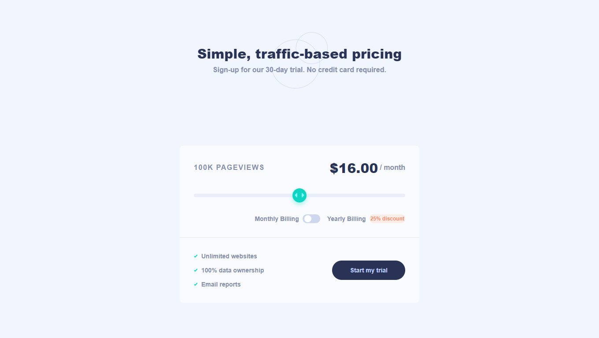

# Frontend Mentor - Interactive pricing component solution

This is a solution to the [Interactive pricing component challenge on Frontend Mentor](https://www.frontendmentor.io/challenges/interactive-pricing-component-t0m8PIyY8). Frontend Mentor challenges help you improve your coding skills by building realistic projects.

## Table of contents

- [Overview](#overview)
  - [The challenge](#the-challenge)
  - [Screenshot](#screenshot)
  - [Links](#links)
- [My process](#my-process)
  - [Built with](#built-with)
  - [What I learned](#what-i-learned)
- [Author](#author)

## Overview

### The challenge

Users should be able to:

- View the optimal layout for the app depending on their device's screen size
- See hover states for all interactive elements on the page
- Use the slider and toggle to see prices for different page view numbers

### Screenshot




### Links

- Live Site URL: [Add live site URL here](https://dm-interactive-pricing-component.vercel.app/)

## My process

### Built with

- Semantic HTML5 markup
- CSS custom properties
- Flexbox
- CSS Grid
- Mobile-first workflow
- [Next.js](https://nextjs.org/) - React framework

### What I learned

This is how I wrote the money value change depending on the state of the input range, see below:

```js
const [money, setMoney] = useState < string > "16.00";

const changeMoneyValue = (e: any) => {
  let value = parseFloat(e.target.value);

  if (value % 1 === 0) {
    setMoney(String(value) + ".00");
  } else {
    setMoney(String(value));
  }
};
```

## Author

- Frontend Mentor - [@DMikaia](https://www.frontendmentor.io/profile/DMikaia)
